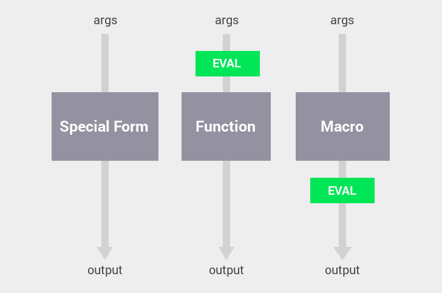

# ClojureScript

Hello and welcome to ClojureScript (CLJS)!  It is a new language for front-end
web development (i.e. a language that compiles to Javascript for use in the
browser).

## The Pitch

CLJS is fundamentally different from Javascript and other compile-to-JS
languages like Dart, CoffeeScript, and LiveScript.  It uses a more powerful yet
simpler syntax, it employs useful defaults to combat the "new spaghetti code"
that is mutatable stateful objects, and it supports a lot of UI data-binding
patterns at a native language level.

## Setting Up

__Leiningen__ is the command-line tool used for building ClojureScript projects.

- [Install JDK](http://www.oracle.com/technetwork/java/javase/downloads/jdk8-downloads-2133151.html) (if you haven't already).
- [Install Leiningen](http://leiningen.org/).

If you want to setup __Sublime Text Editor__ to highlight ClojureScript files,
open any file with a `.cljs` extension in Sublime, then select:

```
View > Syntax > Open all with current extension as... > Clojure
```

## Syntax

There is __literal data__:

```clj
; number
1.23

; string
"foo"

; keyword (like strings, but used as map keys)
:foo

; vector (array)
[:bar 3.14 "hello"] 

; map (associative array)
{:msg "hello" :pi 3.14 :primes [2 3 5 7 11 13]}

; set (distinct elements)
#{:bar 3.14 "hello"}
```

And there is __symbolic data__:

```clj
; symbol (represents a named value)
foo

; list (represents a "call")
(foo :bar 3.14)
```

#### Evaluation

ClojureScript can evaluate data to create a new "value" from it.

1. Literal data evaluates to itself, of course:

    ```clj
    1.23                 ; => 1.23
    "foo"                ; => "foo"
    [:bar 3.14 "hello"]  ; => [:bar 3.14 "hello"]
    ```

1. A __symbol__ evaluates to the value bound to it:

    ```clj
    foo                  ; => 3
    ```

1. A __list__ evaluates to the return value of a "call".

    ```clj
    (+ 1 2 3)            ; => 6
    (= 1 2)              ; => false
    (if true "y" "n")    ; => "y"
    ```

#### Calls

If the first element of a list is a __function__, then the rest of the elements
are evaluated and passed to it.

```clj
; String concatenation
(str "Hello" "World")

; Arithmetic
(= a b)     ; equality (true or false)
(+ a b)     ; sum
(- a b)     ; difference
(* a b c)   ; product
(< a b c)   ; true if a < b < c

; Evaluation Steps
(+ k (* 2 4))   ; assume k evalutes to 3
(+ 3 (* 2 4))   ; (* 2 4) evaluates to 8
(+ 3 8)         ; (+ 3 8) evalutes to 11
11
```

If the first element of a list is one of 16 __special forms__, then the rest of
the elements are passed to it _unevaluated_.

```clj
(if (= a b c)   ; <-- determines if a=b=c
    (foo 1)     ; <-- only evaluated if true
    (bar 2)     ; <-- only evaluated if false
    )

; define k as 3
(def k 3)       ; <-- notice that k is not evaluated here
                ;     (def needs the symbol k, not its value)

; make a greeting function
(fn [username]              ; <-- expected parameters vector
  (str "Hello " username))

; oops, give the function a name
(def greet (fn [username]
  (str "Hello " username)))

(greet "Bob")   ; => "Hello Bob"
```

If the first element of a list is a __macro__, then the rest of the elements
are passed to it unevaluated, but the value returned by a macro evaluated.
Let's illustrate that difference:



This difference in evaluation allows macros to act like code-generating
functions.  For example, the `defn` macro expands to `def` and `fn`, as we used
separately in a previous example:

```clj
; create a named function using the defn macro
(defn greet [username]
  (str "Hello " username))

; the definition for the defn macro (over-simplified)
(defmacro defn [name args body]
  `(def ~name (fn ~args ~body)))
```

App developers rarely need to create their own macros, but it is an
indispensible tool for the library developer to give app developers the full
flexibility of the language.

## Useful Resources

Here are the resources and steps that I took while learning ClojureScript.
(Most resources covering Clojure also apply to ClojureScript, since they
share a significant subset with each other.)

1. Reading the book [ClojureScript Up and Running](http://synrc.com/publications/cat/Functional%20Languages/Clojure/Oreilly.ClojureScript.Up.and.Running.Oct.2012.pdf)
1. Reading the book [Clojure Programming](http://bit.ly/clojurebook)
1. Doing [ClojureScript Koans](http://clojurescriptkoans.com)
1. Reading [ClojureScript Style Guide](https://github.com/bbatsov/clojure-style-guide)
1. Reading [Clojure Programming By Example](http://en.wikibooks.org/wiki/Clojure_Programming/By_Example)
1. Reading [Clojure Functional Programming](http://clojure.org/functional_programming)
1. Thumbing through [Clojure Core API](http://clojure.github.io/clojure/clojure.core-api.html)
1. Reading [ClojureScript - Differences from Clojure - Host Interop](https://github.com/clojure/clojurescript/wiki/Differences-from-Clojure#wiki-host-interop) for accessing javascript properties like `(.-Infinity js/window)` and functions like `(.sqrt js/Math 25)`.
1. Reading [Javascript to ClojureScript synonyms](http://kanaka.github.io/clojurescript/web/synonym.html)
1. Experimenting in `lein repl` for Clojure REPL.
1. Experimenting in <http://clojurescript.net/> for ClojureScript REPL with a browser context.
1. Reading docstrings of functions I encounter with `(doc <funcname>)` in REPL.
1. [Miscellaneous ClojureScript things to know](https://github.com/shaunlebron/ClojureSheet#clojurescript-stuff)
