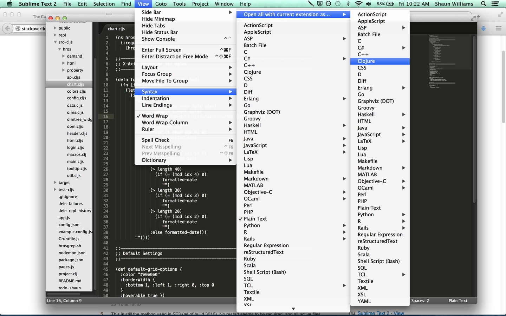

# Starting with CLJS

Hello and welcome to ClojureScript (CLJS)!  It is a new language for front-end
web development (i.e. a language that compiles to Javascript for use in the
browser).

CLJS is fundamentally different from Javascript and other compile-to-JS
languages like Dart, CoffeeScript, and LiveScript.  It uses a more powerful yet
simpler syntax, it employs useful defaults to combat the "new spaghetti code"
that is mutatable stateful objects, and it supports a lot of UI data-binding
patterns at a native language level.

## Setting Up

__Leiningen__ is the command-line tool used for building ClojureScript projects.

- [Install JDK](http://www.oracle.com/technetwork/java/javase/downloads/jdk8-downloads-2133151.html) (if you haven't already).
- [Install Leiningen](http://leiningen.org/).

If you want to setup __Sublime Text Editor__ to highlight ClojureScript files,
open any file with a `.cljs` extension in Sublime, then select `View` >
`Syntax` > `Open all with current extension as...` > `Clojure`:



## Learning

Here are the resources and steps that I took while learning ClojureScript.
(Most resources covering Clojure also apply to ClojureScript, since they
share a significant subset with each other.)

1. Reading the book [ClojureScript Up and Running](http://synrc.com/publications/cat/Functional%20Languages/Clojure/Oreilly.ClojureScript.Up.and.Running.Oct.2012.pdf)
1. Reading the book [Clojure Programming](http://bit.ly/clojurebook)
1. Doing [ClojureScript Koans](http://clojurescriptkoans.com)
1. Reading [ClojureScript Style Guide](https://github.com/bbatsov/clojure-style-guide)
1. Reading [Clojure Programming By Example](http://en.wikibooks.org/wiki/Clojure_Programming/By_Example)
1. Reading [Clojure Functional Programming](http://clojure.org/functional_programming)
1. Thumbing through [Clojure Core API](http://clojure.github.io/clojure/clojure.core-api.html)
1. Reading [ClojureScript - Differences from Clojure - Host Interop](https://github.com/clojure/clojurescript/wiki/Differences-from-Clojure#wiki-host-interop) for accessing javascript properties like `(.-Infinity js/window)` and functions like `(.sqrt js/Math 25)`.
1. Reading [Javascript to ClojureScript synonyms](http://kanaka.github.io/clojurescript/web/synonym.html)
1. Experimenting in `lein repl` for Clojure REPL.
1. Experimenting in <http://clojurescript.net/> for ClojureScript REPL with a browser context.
1. Reading docstrings of functions I encounter with `(doc <funcname>)` in REPL.

_What follows is my attempt to guide you through ClojureScript's fundamentals
and advantages over other languages for the web._

### Data Syntax

Though its syntax is unfamiliar and different, ClojureScript has a surprisingly
simple foundation with wide benefits.  And one can it learn quickly.

This is a __`number`__:

```clj
1.23
```

This is a __`string`__:

```clj
"foo"
```

A __`keyword`__ is like a string, but it is primarily used as a "key" to
retrieve data from a `map`.  (more on this later)

```clj
:foo
```

A __`symbol`__ is used as the name of some saved value.  (more on creating
these later)

```clj
foo
```

A __`list`__ is surrounded by parentheses, and its elements are separated by
whitespace.  It can contain elements of any type, even other lists.

```clj
(foo :bar 3.14 "hello")
```

A __`vector`__ is similar to a list.  It uses square brackets, but keep in
mind, the actual _significant_ difference is how they are "evaluated" (covered
later).

```clj
[foo :bar 3.14 "hello"]
```

A __`map`__ is an associative collection that "maps" a key value to another value.
It is denoted by curly brackets.  (Keys are often `keywords` but can be anything)

```clj
{:msg "hello" :pi 3.14 :primes [2 3 5 7 11 13]}
```

Since commas and newlines are considered whitespace in ClojureScript,
you can use them to make `map`s more readable:

```clj
{:msg "hello", :pi 3.14, :primes [2 3 5 7 11 13]}
; or
{ :msg "hello"
  :pi 3.14
  :primes [2 3 5 7 11 13] }
```

### And that's all the syntax

Now this is where it gets interesting!  All ClojureScript code is written in
its own Data Syntax which we just covered.  The big revelation here is that
"Code is just Data".

In particular, it is the `list` data type that is treated as code.  For
example, if `foo` is a function, then this is how you call it with some
parameters.

```clj
(foo :bar 3.14 "hello")
```

In fact, all the usual arithmetic operators are functions too.
For example, `+` `-` `*` `=` `<` `>` are all functions.

```clj
(= a b)     ; equality (true or false)
(+ a b)     ; sum
(- a b)     ; difference
(* a b c)   ; product
(< a b c)   ; true if a < b < c
```

And here is an `if` expression:

```clj
(if (= a b c)   ; <-- determines if a=b=c
    (foo 1)     ; <-- called if true
    (bar 2)     ; <-- called if false
    )
```

Notice that the `if` expression above is actually a list of lists.  Let's look
at a simpler example of a list of lists to see how it is __evaluated__ step by
step:

```clj
(+ k (* 2 4))
```

This is adding the value of `k` to the product of 2 and 4.  Assuming that `k`
is a symbol representing a var of value 3, the evaluation is carried out as
follows:

```clj
(+ k (* 2 4))   ; as we stated, k evalutes to 3
(+ 3 (* 2 4))   ; (* 2 4) evaluates to 8
(+ 3 8)         ; (+ 3 8) evalutes to 11
11
```

Notice that both `lists` and `symbols` are __evaluated__ to new values.  This
is a crucial step in understanding ClojureScript.

__Numbers, strings, and keywords simply evaluate to themselves__, meaning
ClojureScript takes them at face value without doing anything extra.

```clj
123    ; => 123
"foo"  ; => "foo"
:foo   ; => :foo
```

But as we saw a moment ago, __symbols evaluate to the values they are bound
to__:

```clj
(def k 3)    ; bind k to the value of 3
k            ; => 3
```

__A vectors evaluates to a vector of its evaluated elements.__  In other words,
it evalutes to itself, but with all its elements evaluated.  Same goes for maps.

```clj
["hello" (+ 1 2)]  ; => ["hello" 3]
```

```clj
{:msg "hello" :sum (+ 1 2)} ; => {:msg "hello" :sum 3}
```

__Lists are evaluated as code__.  The full nature of this evaluation depends on
the first element of the list. (functions vs macros vs special forms)


### Complaints

Let's immediately address the instinctual complaints we all have when first
encountering this unfamiliar syntax and its potential for lots of parentheses.

Despite the unfamiliarity, you just learned everything you need to know about
the syntax, so it is very simple to learn and keep in one's head.

As with all other languages, readability is improved with standard indentation
practices.  It is also trivial to manage parentheses in any editor.  For
example, Sublime Text simply underlines matching parens touching your cursor:


Some even allow you to outline all code inside matching parens (using Sublime Text's
"Bracket Highlighter" plugin with "high visibility" enabled):


### Benefits

